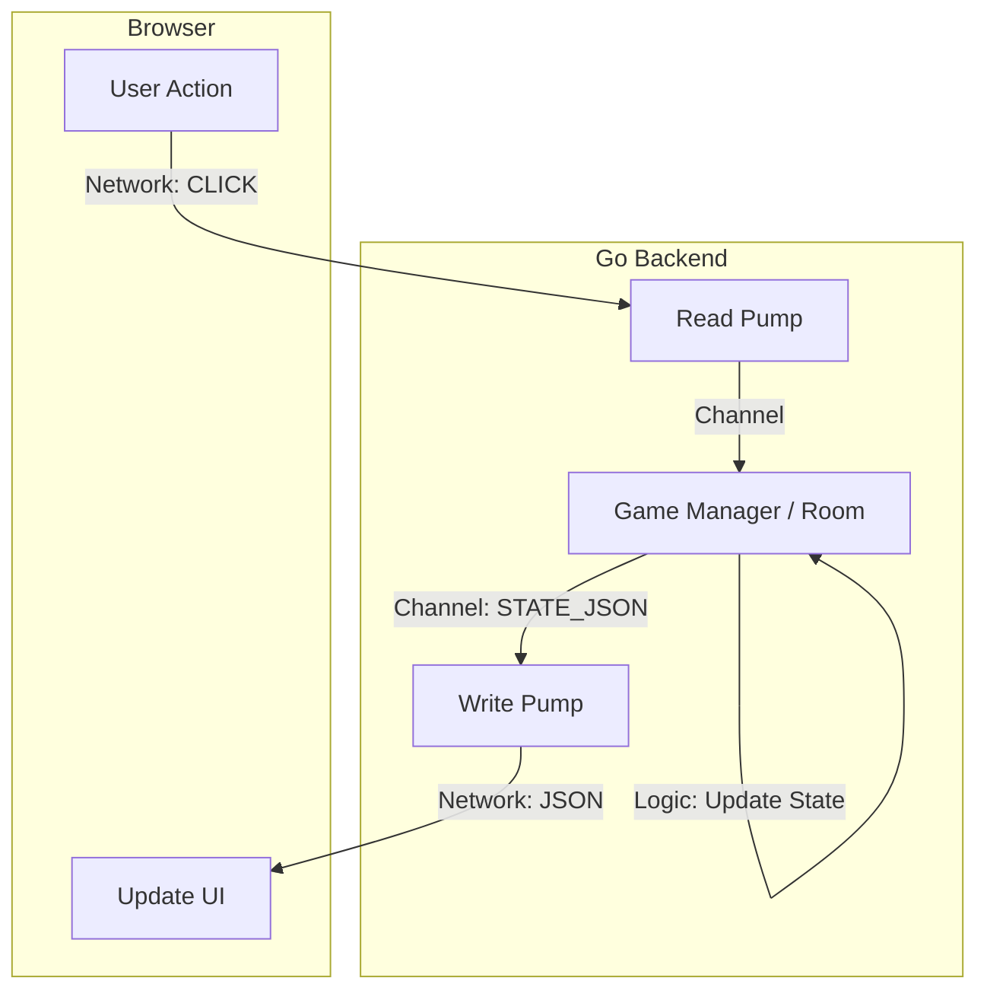

# Concurrency Concepts in Overcookied

This project leverages Go's powerful concurrency primitives. This document explains the two core concepts used: **Goroutines** and the **Pump Model**.

## 1. Goroutines

### What are they?
A Goroutine is a lightweight thread managed by the Go runtime.
-   **Lightweight**: They cost very little memory (kB vs MB for OS threads) and startup time is negligible.
-   **Multiplexed**: Thousands of goroutines can run on a single OS thread. The Go runtime creates and destroys them as needed.

### How we use them
In `Overcookied`, we use goroutines to handle **parallel tasks** without blocking the main program.

*   `main()`: Runs the HTTP server.
*   `go manager.Run()`: Runs the central Game Manager logic in the background.
*   `go client.readPump()`: One goroutine *per client* to listen for incoming data.
*   `go client.writePump()`: One goroutine *per client* to send outgoing data.
*   `go room.Run()`: One goroutine *per active game* to run the game loop (ticker, score updates).

Because they are so cheap, we can easily have 4 goroutines active for a single 1v1 match (2 per player) + 1 for the room itself, and scale to thousands of players without issue.

---

## 2. The Pump Model

The "Pump Model" is a canonical pattern in Go WebSocket applications (popularized by the `gorilla/websocket` examples). It solves a specific problem: **WebSockets allow concurrent reading and writing, but the underlying network connection is not thread-safe for simultaneous writes.**

### The Problem
If your Game Loop tries to write `{"score": 10}` to a socket, and simultaneously the Heartbeat Ticker tries to write `Ping`, you might corrupt the TCP stream or crash the program.

### The Solution: Separate Concerns

We split the responsibility of interacting with the socket into two completely independent pumps (goroutines) connected by **Channels**.

#### A. The Read Pump (Input)
*   **Job**: "Pump" data from the network -> into the Application.
*   **Behavior**: It sits in a loop `for { conn.ReadMessage() }`.
*   **Blocking**: This call blocks until data arrives. This is why it *must* be in its own goroutine; otherwise, the server would freeze waiting for one user to click!
*   **Action**: When a packet arrives, it sends it to the `GameManager` via a channel.

#### B. The Write Pump (Output)
*   **Job**: "Pump" data from the Application -> into the network.
*   **Behavior**: It sits in a `select` loop listening on a channel `<-client.send`.
*   **Single Writer Principle**: This is the **ONLY** place in the entire code that calls `conn.WriteMessage()`.
*   **Queueing**: When the Game Loop updates the score, it doesn't write to the network. It creates a message and drops it in the `client.send` channel. The Write Pump picks it up immediately and sends it.

### Visual Diagram

### Why this is powerful
1.  **Safety**: No locks are needed on the socket writes because only one goroutine ever touches it.
2.  **Responsiveness**: The Game Logic never waits for the network. It dumps a message in the "mailbox" (channel) and keeps running.
3.  **Flow Control**: If a client is too slow (internet lag), the channel fills up. We can detect this and drop packets or disconnect them without slowing down the rest of the server.
