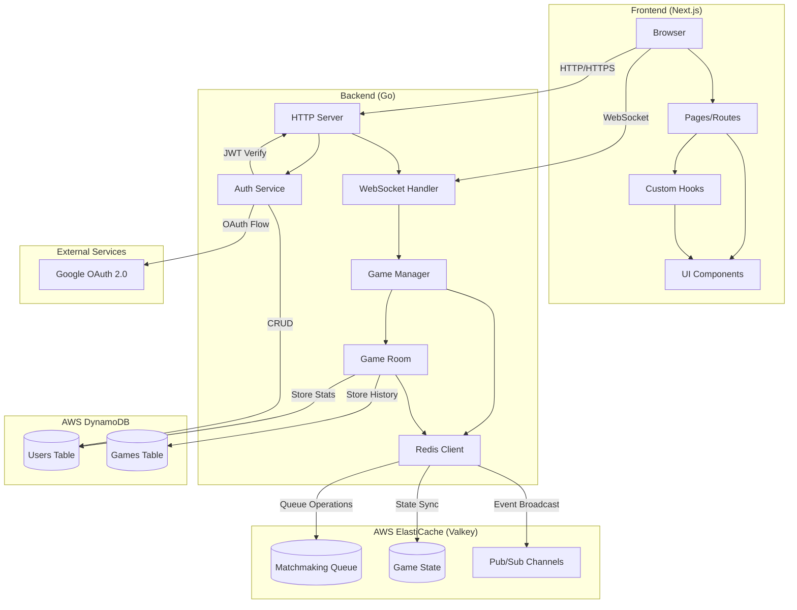
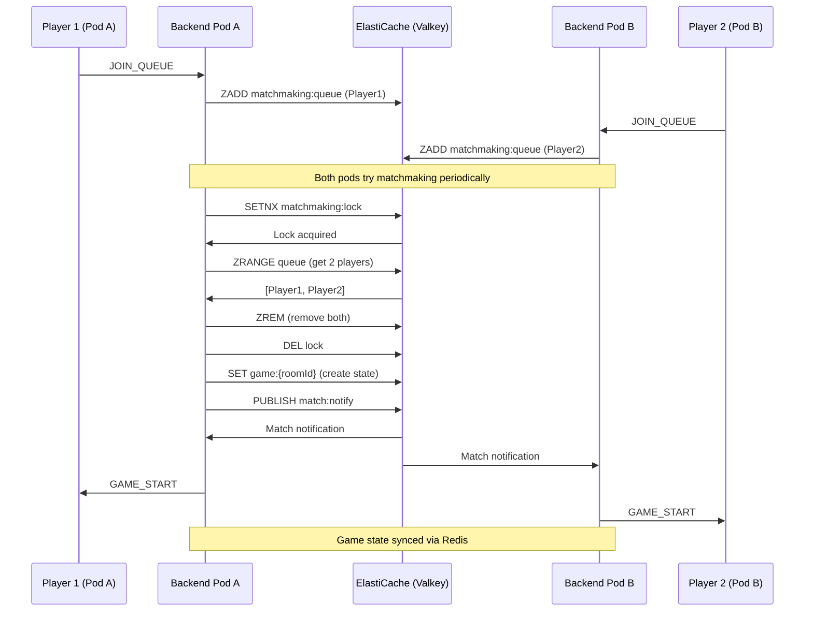
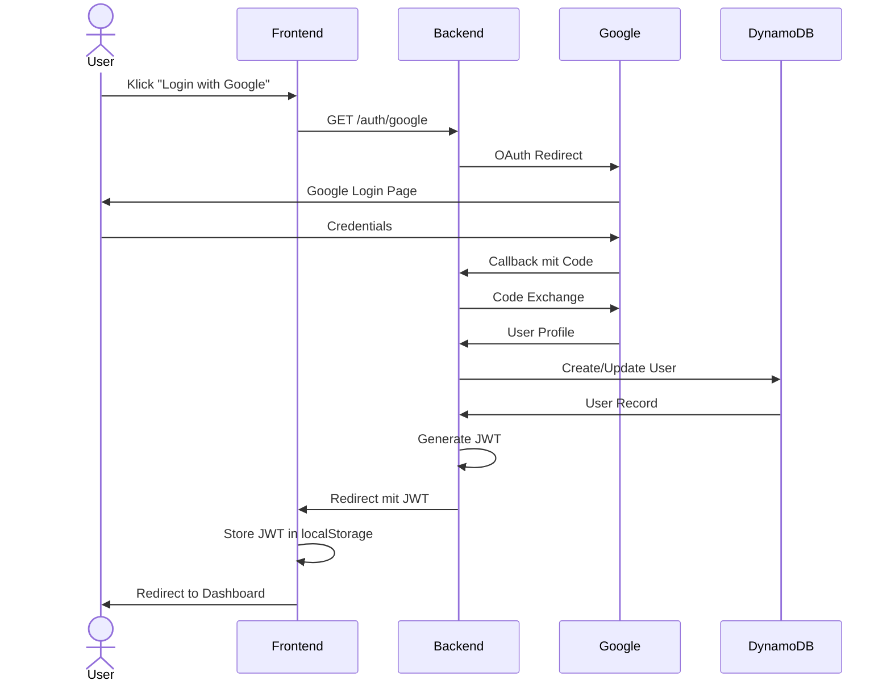
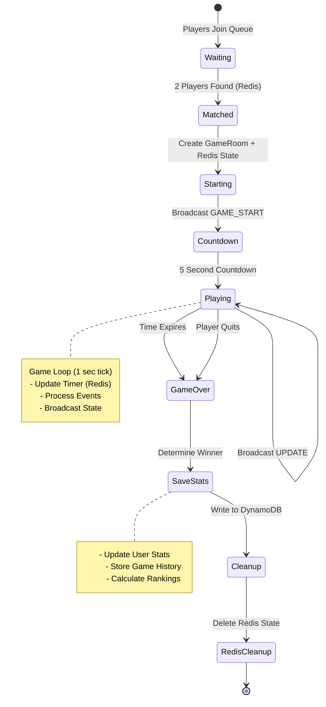
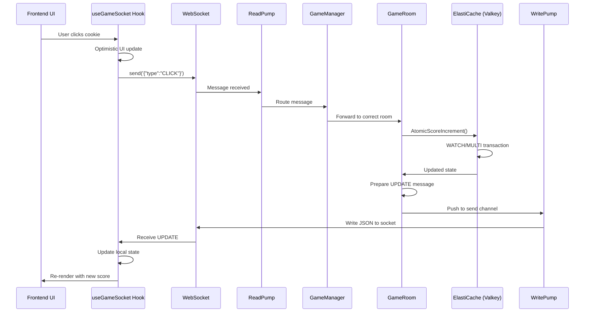
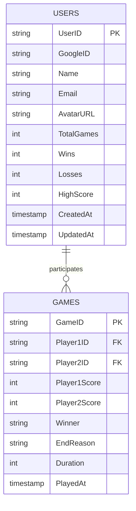
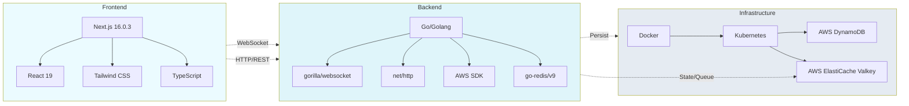
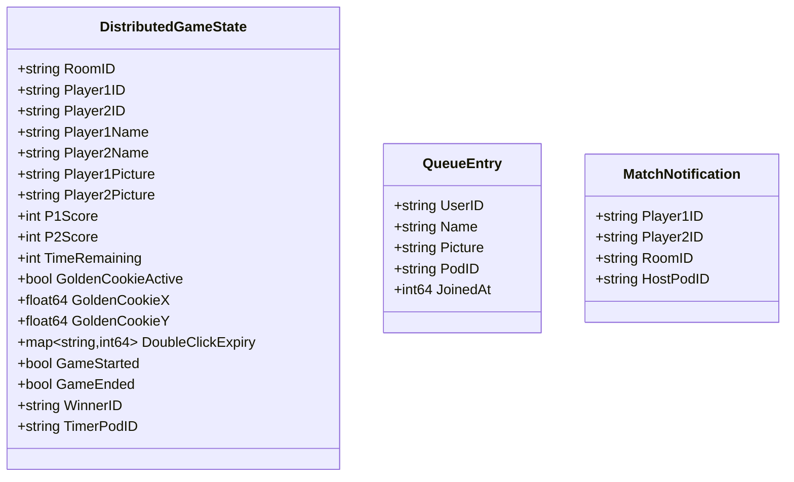

# Overcookied - Architekturdiagramm

## System-Übersicht



## Distributed Matchmaking Flow



## Authentifizierungsfluss



## WebSocket-Architektur

```mermaid
graph TB
    subgraph "Client Connection"
        Client[Client Browser]
        WS[WebSocket Connection]
    end

    subgraph "Backend WebSocket Layer"
        ServeWS[serveWs Handler]
        ClientStruct[Client Struct]
        ReadPump[Read Pump Goroutine]
        WritePump[Write Pump Goroutine]
        SendChannel[send channel]
    end

    subgraph "ElastiCache (Valkey)"
        RedisQueue[(Matchmaking Queue)]
        RedisState[(Game State)]
        RedisPubSub[Pub/Sub]
        RedisLock[Distributed Lock]
    end

    subgraph "Game Logic Layer"
        Manager[Game Manager]
        Room1[Game Room 1]
        Room2[Game Room 2]
        RoomN[Game Room N]
    end

    Client -->|ws://server/ws| ServeWS
    ServeWS -->|HTTP Upgrade| WS
    ServeWS -->|Create| ClientStruct
    ClientStruct -->|spawn| ReadPump
    ClientStruct -->|spawn| WritePump
    ReadPump -->|Messages| Manager
    Manager -->|Add to Queue| RedisQueue
    Manager -->|Acquire Lock| RedisLock
    RedisLock -->|Create Match| Room1
    RedisLock -->|Create Match| Room2
    RedisLock -->|Create Match| RoomN
    Room1 -->|State Sync| RedisState
    Room2 -->|State Sync| RedisState
    RoomN -->|State Sync| RedisState
    Room1 -->|Broadcast Events| RedisPubSub
    Room2 -->|Broadcast Events| RedisPubSub
    RoomN -->|Broadcast Events| RedisPubSub
    Room1 -->|State Updates| SendChannel
    Room2 -->|State Updates| SendChannel
    RoomN -->|State Updates| SendChannel
    SendChannel -->|JSON| WritePump
    WritePump -->|TCP| WS
    WS -->|Network| Client

    style "Client Connection" fill:#e3f2fd
    style "Backend WebSocket Layer" fill:#fff3e0
    style "ElastiCache (Valkey)" fill:#ffcdd2
    style "Game Logic Layer" fill:#f3e5f5
```

## Game Room Lifecycle



## Nachrichtenfluss: Cookie Click



## Datenmodell



## Deployment-Architektur

```mermaid
graph TB
    subgraph "Client Layer"
        Users[Users/Browsers]
    end

    subgraph "Kubernetes Cluster"
        Ingress[Ingress Controller]
        
        subgraph "Frontend Service"
            FE1[Frontend Pod 1]
            FE2[Frontend Pod 2]
            FEService[Frontend Service]
        end
        
        subgraph "Backend Service"
            BE1[Backend Pod 1]
            BE2[Backend Pod 2]
            BEService[Backend Service]
        end
    end

    subgraph "AWS Cloud"
        subgraph "ElastiCache"
            Valkey[(Valkey 8.0)]
        end
        DDB[(DynamoDB)]
    end

    subgraph "External"
        OAuth[Google OAuth]
    end

    Users -->|HTTPS| Ingress
    Ingress --> FEService
    Ingress --> BEService
    FEService --> FE1
    FEService --> FE2
    BEService --> BE1
    BEService --> BE2
    BE1 -->|Game State/Queue| Valkey
    BE2 -->|Game State/Queue| Valkey
    BE1 --> DDB
    BE2 --> DDB
    BE1 --> OAuth
    BE2 --> OAuth

    style "Client Layer" fill:#e3f2fd
    style "Kubernetes Cluster" fill:#fff3e0
    style "AWS Cloud" fill:#f3e5f5
    style "External" fill:#e8f5e9
```

## Technologie-Stack



## Concurrency-Modell (Backend)

```mermaid
graph TB
    subgraph "Main Goroutine"
        Main[main.go]
        HTTPServer[HTTP Server]
    end

    subgraph "Per-Client Goroutines"
        RP1[ReadPump 1]
        WP1[WritePump 1]
        RP2[ReadPump 2]
        WP2[WritePump 2]
        RPN[ReadPump N]
        WPN[WritePump N]
    end

    subgraph "Per-Room Goroutines"
        Room1[GameRoom.Run 1]
        Room2[GameRoom.Run 2]
        RoomN[GameRoom.Run N]
        
        Ticker1[Ticker 1]
        Ticker2[Ticker 2]
        TickerN[Ticker N]
        
        Room1 --> Ticker1
        Room2 --> Ticker2
        RoomN --> TickerN
    end

    subgraph "Shared State Protection"
        Mutex1[sync.Mutex 1]
        Mutex2[sync.Mutex 2]
        MutexN[sync.Mutex N]
    end

    Main --> HTTPServer
    HTTPServer -->|spawn| RP1
    HTTPServer -->|spawn| WP1
    HTTPServer -->|spawn| RP2
    HTTPServer -->|spawn| WP2
    HTTPServer -->|spawn| RPN
    HTTPServer -->|spawn| WPN

    RP1 -.->|protected by| Mutex1
    Ticker1 -.->|protected by| Mutex1
    RP2 -.->|protected by| Mutex2
    Ticker2 -.->|protected by| Mutex2
    RPN -.->|protected by| MutexN
    TickerN -.->|protected by| MutexN

    Room1 --> WP1
    Room1 --> WP2
    Room2 --> WP1
    Room2 --> WP2

    style "Main Goroutine" fill:#fff3e0
    style "Per-Client Goroutines" fill:#e1f5ff
    style "Per-Room Goroutines" fill:#f3e5f5
    style "Shared State Protection" fill:#ffebee
```

## Message Types (WebSocket Protocol)

```mermaid
graph TB
    subgraph "Client → Server"
        C1[JOIN_QUEUE]
        C2[CLICK]
        C3[COOKIE_CLICK]
        C4[QUIT_GAME]
    end

    subgraph "Server → Client"
        S1[GAME_START]
        S2[UPDATE]
        S3[OPPONENT_CLICK]
        S4[COOKIE_SPAWN]
        S5[GAME_OVER]
    end

    subgraph "Game State Machine"
        State[Game State]
    end

    C1 -->|Matchmaking| State
    C2 -->|Score +1| State
    C3 -->|Special Bonus| State
    C4 -->|End Game| State
    
    State -->|Initialize| S1
    State -->|Periodic Sync| S2
    State -->|Notify| S3
    State -->|Event| S4
    State -->|Finish| S5

    style "Client → Server" fill:#e3f2fd
    style "Server → Client" fill:#fff3e0
    style "Game State Machine" fill:#f3e5f5
```

## ElastiCache (Valkey) Key Schema

```mermaid
graph TB
    subgraph "Matchmaking Keys"
        Queue["overcookied:matchmaking:queue<br/>(Sorted Set - timestamp score)"]
        Lock["overcookied:matchmaking:lock<br/>(String - distributed lock)"]
        Notify["overcookied:match:notify<br/>(Pub/Sub channel)"]
    end

    subgraph "Game State Keys"
        GameState["overcookied:game:{roomId}<br/>(JSON - game state)"]
        GameEvents["overcookied:game:events<br/>(Pub/Sub channel)"]
    end

    subgraph "Key Properties"
        QueueTTL["Queue Entry TTL: 30s"]
        LockTTL["Lock TTL: 2s"]
        StateTTL["Game State TTL: 10min"]
    end

    Queue -.-> QueueTTL
    Lock -.-> LockTTL
    GameState -.-> StateTTL

    style "Matchmaking Keys" fill:#e3f2fd
    style "Game State Keys" fill:#fff3e0
    style "Key Properties" fill:#f3e5f5
```

## Distributed Game State Structure


